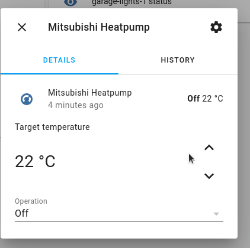

# HomeAssistant MQTT Climate entity for Mitsubishi heatpump

This repository contains an example of the configuration needed for an MQTT
climate sensor for a Mitsubishi heatpump controlled via serial using an
ESP8266/ESP32 using https://github.com/SwiCago/HeatPump.

This configuration can replace the https://github.com/lekobob/mitsu_mqtt custom
component that no longer works with newer versions of HomeAssistant due to
various deprecations.

## What is implemented

| Feature | Implemented |
| ------- | --------- |
| Shows available temperature range | Yes, based on https://github.com/SwiCago/HeatPump#controlling-the-heat-pump |
| Power on/off | Yes |
| Set temperature | Yes |
| Change mode (cool/heat/dry/auto etc) | Yes |
| Set swing mode | Not yet |
| Set horizontal swing mode | Not yet - maybe not possible based on MQTT Climate config available |
| Set fan speed | Not yet |

## How to use

Copy [the configuration](https://github.com/joshmcarthur/homeassistant-climate-mitsubishi-mqtt/blob/main/configuration.yaml#L14) out of `configuration.yaml` for the climate sensor.

You probably want to change the name of the entity to something that is relevant to where the heatpump is or its purpose.

## How to test or try new things

A `docker-compose.yml` is included in this repository. It's not intended for CI
or anything, but it can be used to quickly bring up a new HomeAssistant
instance. You'll need to go through the onboarding for a new instance, fill it
in with whatever details you want, but you'll then have the entity already there
ready to test out.

You can hit the 'c' character then search for 'restart' to restart HA when
trying out different config in configuration.yaml, or just stop and start the
docker-compose service.

If you are able to support something new, please open a PR with your configuration so others can benefit. There are a range of features that should be easy to support, I just haven't needed them since I almost always run my heatpump on auto fan, auto mode, and just change the temperature.